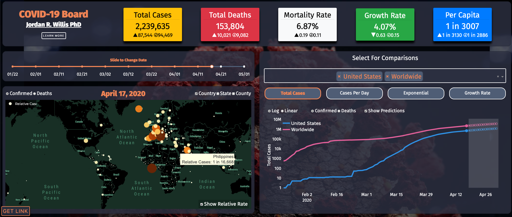

`COVID-19 Bored` is a web application that uses Country, US state and US county wide data to plot, track and predict confirmed cases and deaths. COVID-19 Bored, is a DashBoard I created while bored, hence COVID-19 *Bored*.




`COVID-19 Bored` is a written with a high level python framework called [Dash](https://dash.plotly.com/introduction) which abstracts React.js components to serve plotly graphs. It's amazing. I serve the entire Dash app to an Elastic Beanstalk container using AWS. Since Dash is served with Flask, it's [easy](https://docs.aws.amazon.com/elasticbeanstalk/latest/dg/create-deploy-python-flask.html)

**Data**

--- 
Please see the [API backend](https://github.com/jwillis0720/covid19api) for more information on how data is collected. tl;dr - I serve a pandas pickle file through S3. You can find that directly [here](https://jordansdatabucket.s3-us-west-2.amazonaws.com/covid19data/MASTER_ALL_NEW.pkl).


**Usage**

---

```
python application.py
```

**Installation Options**

---

```
git clone https://github.com/jwillis0720/covid_19.git
pip install -r requirements
python application.py
```
**Inspirations**

--- 

There are a thousand COVID-19 apps. Here are a few of my favorites:

[Outbreak.info](https://outbreak.info/epidemiology?location=USA%3BESP%3BITA%3BFRA%3BDEU&log=true&variable=confirmed_numIncrease&fixedY=false) - The absolute gold standard. 
 
 [1point3acres](https://coronavirus.1point3acres.com/en/world) - Made early stage by Chinese immigrants

[ncov19.us](https://ncov19.us/?fbclid=IwAR3XYsiYE1YVhgF8P3ivGO88T4Nzy71G_0eIzcxQPXFo63VAyZeOlWcQHX0)

[coronavirustracker.co.uk](https://www.coronavirustracker.co.uk/)

---
Find me  [here](https://www.linkedin.com/in/jwillis0720)


